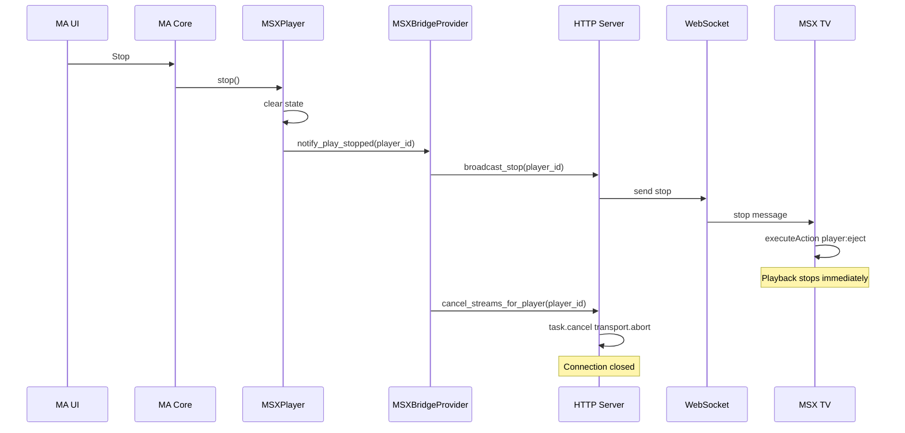

# Мгновенная остановка воспроизведения при Stop в MA

## Текущее поведение и цепочка

При нажатии Stop в MA происходит:

1. MA core вызывает `player.stop()` (например через `cmd_stop`).
2. [player.py](provider/msx_bridge/player.py) — `MSXPlayer.stop()`: сбрасывает состояние, вызывает `provider.notify_play_stopped(self.player_id)`.
3. [provider.py](provider/msx_bridge/provider.py) — `notify_play_stopped()`: вызывает `cancel_streams_for_player(player_id)`, затем `broadcast_stop(player_id)`.
4. **cancel_streams_for_player**: отменяет задачи стрима (`task.cancel()`) и делает `transport.abort()` для всех активных стримов этого плеера ([http_server.py](provider/msx_bridge/http_server.py) 843–859). Стримы регистрируются и для `/stream/{player_id}`, и для `/msx/audio/{player_id}` (769–776).
5. **broadcast_stop**: шлёт по WebSocket `{type: "stop", showNotification}` подписантам по `player_id` (888–908).
6. Плагин на TV ([plugin.html](provider/msx_bridge/static/plugin.html) 48–53): при `msg.type === "stop"` вызывает `tvx.InteractionPlugin.executeAction("eject" | "player:eject")`, что должно сразу остановить плеер MSX.

Описание проблемы в [docs/TODO.md](docs/TODO.md): «либо не реагирует никак, либо закрывается только через 30 секунд». Уже пробовали отмену стримов и `transport.abort()` — задержка осталась; предполагались буфер MA или MSX.

---

## Возможные причины

| Причина                         | Эффект                                                                                                                                                                                                                |
| ------------------------------- | --------------------------------------------------------------------------------------------------------------------------------------------------------------------------------------------------------------------- |
| **Нет подписчиков WS**          | `broadcast_stop` не шлёт никому → в логах «No WebSocket clients for player X» → TV не получает eject.                                                                                                                 |
| **Несовпадение player_id**      | WS подписан с одним `player_id` (например по `device_id`), а Stop приходит для другого (например по IP) → broadcast идёт «в пустоту».                                                                                 |
| **Порядок: сначала рвём стрим** | Сначала `cancel_streams` (обрыв TCP), потом `broadcast_stop`. TV может дольше обрабатывать обрыв соединения (буфер, таймауты), а команда eject приходит уже после обрыва или не успевает применить к текущему плееру. |
| **Буфер на TV**                 | Даже при обрыве соединения MSX может доигрывать буфер (десятки секунд), если не получил явный eject.                                                                                                                  |
| **transport не тот или None**   | Если `request.transport` не заполнен, `abort()` не вызывается, обрыв соединения затягивается.                                                                                                                         |

Итог: для мгновенной остановки важно, чтобы TV **сразу** получил команду eject по WebSocket; обрыв стрима — дополнительная мера, чтобы соединение не висело.

---

## Предлагаемые изменения

### 1. Порядок операций в `notify_play_stopped`: сначала WebSocket, потом отмена стримов

**Файл:** [provider/msx_bridge/provider.py](provider/msx_bridge/provider.py)

Сейчас: `cancel_streams_for_player(player_id)` → `broadcast_stop(player_id)`.

Сделать: **сначала** `broadcast_stop(player_id)`, **затем** `cancel_streams_for_player(player_id)`.

- TV сразу получает `stop` и вызывает `executeAction("player:eject")` — плеер MSX останавливается без ожидания обрыва TCP.
- После этого отмена стримов и `transport.abort()` закрывают соединение со стороны сервера на случай, если TV не закрыл его сам.

### 2. Согласованность player_id (WebSocket и остальные запросы)

**Проблема:** Если TV подключается к WS с `device_id`, то `player_id = msx_<sanitized_device_id>`. Если часть запросов (например, только часть контента) идёт без `device_id`, плеер может быть зарегистрирован как `msx_<ip>`. Тогда Stop в MA будет для `msx_<ip>`, а подписанты WS — под `msx_<device_id>`, и broadcast не дойдёт.

**Действия:**

- В [provider/msx_bridge/static/plugin.html](provider/msx_bridge/static/plugin.html) уже передаётся `device_id` в URL WS при наличии (`WS_URL + "?device_id=" + ...`). Убедиться, что при открытии плагина и навигации по библиотеке везде используется один и тот же идентификатор (тот же `device_id` или тот же fallback), чтобы контент и стрим запрашивались с тем же `player_id`, под которым открыт WS.
- На сервере в [http_server.py](provider/msx_bridge/http_server.py) в `_handle_ws` используется `_get_player_id_and_device_param(request)` — тот же расчёт, что и для контента. Достаточно гарантировать, что TV всегда передаёт `device_id` в запросах к стриму/аудио, если передаёт его в WS (контент уже идёт с `device_id` через `addDeviceParam`; проверить, что URL воспроизведения — `/msx/audio/{player_id}` и `/stream/{player_id}` — строятся с тем же `device_id` там, где они задаются в JSON).
- Опционально: при отсутствии подписчиков в `broadcast_stop` логировать не только «skip stop broadcast», но и текущий `player_id` и список ключей `_ws_clients`, чтобы по логам быстро увидеть несовпадение (уровень — warning, уже есть).

### 3. Гарантированная отмена стрима и обрыв соединения

Оставить вызов `cancel_streams_for_player` после broadcast. В [http_server.py](provider/msx_bridge/http_server.py) уже:

- регистрируются и задача стрима, и `transport` для обоих эндпоинтов;
- при отмене вызываются `task.cancel()` и `transport.abort()`.

Опционально (если по логам видно, что transport часто None): при подготовке стрима логировать наличие `transport` для отладки; при необходимости позже можно рассмотреть альтернативные способы закрытия ответа (например явное закрытие response), не меняя текущую логику как первый шаг.

### 4. Клиент: надёжная обработка stop

В [plugin.html](provider/msx_bridge/static/plugin.html) при `msg.type === "stop"` уже вызывается `executeAction`. Имеет смысл:

- Убедиться, что используется именно действие, которое в MSX сразу останавливает воспроизведение (текущее: `"eject"` или `"player:eject"` — оставить как есть, при необходимости свериться с документацией MSX).
- Опционально: в `catch (e) {}` при обработке сообщений логировать ошибку (например `console.warn`), чтобы видеть сбои `executeAction` на реальных устройствах.

### 5. Диагностика

- Уже есть предупреждение в `broadcast_stop` при отсутствии клиентов. После смены порядка (сначала broadcast) по логам будет видно: если «No WebSocket clients» при каждом Stop — причина в подписке/player_id; если клиенты есть, но остановка всё равно с задержкой — смотреть в сторону MSX (буфер, обработка eject).
- При необходимости добавить краткий пункт в [docs/TODO.md](docs/TODO.md): «Проверить мгновенный Stop: сначала broadcast_stop, потом cancel_streams; единый player_id (device_id) для WS и стрима».

---

## Порядок внедрения

1. Поменять порядок в `notify_play_stopped`: сначала `broadcast_stop`, затем `cancel_streams_for_player`.
2. Проверить формирование URL стрима/аудио в плагине и контент-ответах (единый `device_id`/player_id с WS).
3. Прогнать сценарий: воспроизведение с TV (по клику в MSX) → Stop в MA → ожидаем мгновенную остановку; при отсутствии — смотреть логи (WS clients, player_id).
4. При необходимости усилить логирование (transport, ошибки в плагине) и обновить TODO.

---

## Схема после изменений

Критичное изменение: TV получает команду остановки по WebSocket до обрыва стрима, поэтому может сразу остановить воспроизведение без ожидания закрытия TCP.