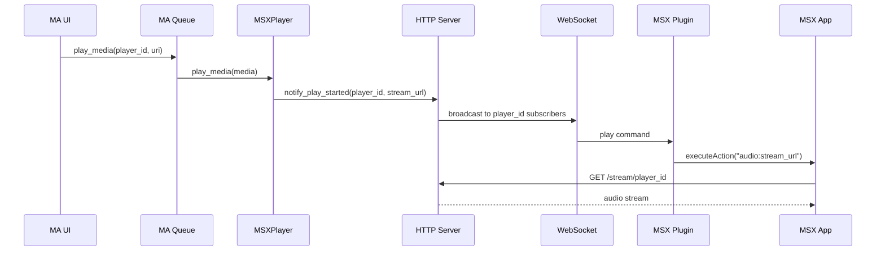

# Анализ: push-воспроизведение MA → MSX

## Контекст

Сейчас MSX использует **pull**: воспроизведение начинается только когда пользователь кликает трек в MSX-UI. При «Play» из MA трек ставится в очередь, MA показывает «играет», но MSX ничего не делает — устройство не знает, что нужно запрашивать поток.

---

## Вариант 1: Long-polling / WebSocket

### Суть

MSX-плагин (Interaction Plugin) периодически опрашивает или держит WebSocket-соединение с сервером; при событии «play» из MA сервер отдаёт команду, плагин вызывает `executeAction("audio:...")` и MSX начинает воспроизведение.

### Анализ осуществимости: **РЕАЛИЗУЕМО**

**Почему подходит:**

1. **Interaction Plugin** — обычная HTML/JS-страница в iframe, загружается с нашего сервера (`http://bridge/msx/plugin.html`). Имеет доступ к `fetch`, `XMLHttpRequest`, `WebSocket` и может обращаться к нашему серверу.
2. **API MSX** — `TVXInteractionPlugin.executeAction(action, data)` может вызывать `audio:{url}`. При клике на трек MSX обрабатывает `action: "audio:http://..."`. Вызов `executeAction("audio:" + streamUrl)` из плагина даст тот же эффект.
3. **Потоковый URL** — при `play_media` на плеере ставится `current_stream_url`; `/stream/{player_id}` проксирует поток. URL вида `http://bridge/stream/msx_xxx` можно передать в `executeAction`.
4. **Интеграция с MA** — `MSXPlayer.play_media()` вызывается из MA core. В методе можно уведомить наш HTTP-сервер о событии (через provider), а сервер — разослать его по WebSocket клиентам с соответствующим `player_id`.

**Архитектура (упрощённо):**

**Что нужно реализовать:**

- WebSocket-эндпоинт (или SSE) в [http_server.py](provider/msx_bridge/http_server.py)
- Регистрация клиентов по `player_id` (из query/header)
- Вызов уведомления из [player.py](provider/msx_bridge/player.py) в `play_media()` (через provider → server)
- В [plugin.html](provider/msx_bridge/static/plugin.html) — подключение к WebSocket при `init`, обработка сообщений и вызов `executeAction("audio:" + url)`

**Ограничения:**

- Плагин загружается при входе в MSX Music Assistant и живёт, пока открыт наш контент. Если пользователь ушёл в другой раздел MSX, плагин может быть выгружен — push работать не будет.
- Нужно учитывать ES5 и ограничения TV-браузеров при выборе API (WebSocket обычно поддерживается).

---

## Вариант 2: Callback URL

### Суть

При «Play» MA вызывает URL на устройстве (callback), устройство само запускает воспроизведение.

### Анализ осуществимости: **НЕ РЕАЛИЗУЕМО** в типичной домашней сети

**Почему не подходит:**

1. **NAT** — ТВ/телефон обычно за NAT, без портов и публичного IP. MA не может инициировать HTTP-запрос к устройству.
2. **MSX** — не предусматривает регистрацию callback URL и не предоставляет API, где бы устройство «подписывалось» на входящие вызовы от внешнего сервера.
3. **Исключения** — callback возможен только если:
  - устройство с публичным IP и открытыми портами,
  - используется туннель (ngrok и т.п.),
  - есть сторонний push-сервис (FCM и т.д.) — но MSX такого не поддерживает.

Для обычной домашней сети это нереалистично.

---

## Рекомендация

**Реализовывать Вариант 1 (WebSocket / long-polling).** Вариант 2 в стандартной конфигурации не подходит из‑за NAT и архитектуры MSX.

**Минимальный MVP для Варианта 1:**

1. WebSocket-роут в `http_server.py`, привязка клиентов к `player_id`
2. Хук в `MSXPlayer.play_media()` → уведомление сервера → broadcast по WebSocket
3. В `plugin.html` — WebSocket-клиент, при получении команды play вызов `executeAction("audio:" + streamUrl)`

