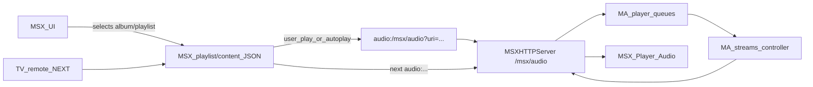

## Цель гибридного режима

Сделать режим, в котором:

- **MSX** управляет навигацией по плейлисту (next/prev, окончание трека, порядок воспроизведения), используя нативный `playlist:`/`content:` и список элементов.
- **Music Assistant (MA)** остаётся единым источником звука и логики очереди: каждый элемент плейлиста на MSX запускает `audio:/msx/audio/{player_id}?uri=...`, а MA через `play_media`/очередь отдаёт один трек.
- Состояния на стороне MA и MSX остаются максимально согласованными, при этом **не используется flow‑стрим** для этого режима (только одиночные треки).

## Архитектура гибридного режима (концепция)

- **MSX UI:**
  - Для альбомов/плейлистов отображается список треков, как и сейчас.
  - При запуске воспроизведения в гибридном режиме MSX получает:
    - либо `playlist:{URL}`/`content:{URL}` с JSON‑структурой треков;
    - либо использует существующую контент‑страницу как источник элементов.
  - Каждый трек внутри этого контента имеет `action: "audio:/msx/audio/{player_id}?uri={ma_uri}"`.
- **MA MSX Bridge:**
  - При первом `audio:` запросе для трека:
    - создаёт/обновляет очередь MA для данного `player_id`.
    - ставит текущий трек в начало этой очереди (либо перескакивает к нужному элементу).
  - По окончании трека **MSX сам вызывает следующий `audio:**` из плейлиста, тем самым инициируя следующий трек в MA.
  - Вся логика перехода между треками реализуется **на стороне MSX**, а MA отдаёт один трек за запрос.

## Изменения в backend MSX Bridge (MA)

### 1. Введение флага/режима гибридного плейлиста

- **Конфиг MSX Bridge:**
  - Добавить опцию `playlist_mode`/`playback_mode` с возможным значением:
    - `radio` (flow, без duration — уже запланировано отдельно),
    - `native_playlist` (чисто MSX‑плейлист без MA очереди),
    - `hybrid_playlist_queue` (нужный гибридный режим).
  - Реализовать чтение этого флага в `MSXBridgeProvider` и передачу в `MSXHTTPServer`/`MSXPlayer`.

### 2. Обработка `/msx/audio` в гибридном режиме

- В `http_server.py` в обработчике `_handle_msx_audio`:
  - **Определение режима:**
    - Проверить конфиг/флаг: если `hybrid_playlist_queue`, то **отключить форсированный flow_mode** (`force_flow_mode=False`) и работать в режиме одиночного трека.
  - **Создание/обновление очереди:**
    - Перед вызовом `play_media`/`get_stream`:
      - Получить/создать очередь `queue = mass.player_queues.get_or_create(player_id)`.
      - Убедиться, что в очереди текущий трек соответствует URI из запроса:
        - если очередь пуста или другой элемент в `current_item`, очистить/пересоздать очередь только с этим треком;
        - альтернативно — попытаться найти существующий элемент с этим `uri` и переместить его на текущую позицию.
    - Явно указать «режим одиночного трека» (без flow‑стрима) при получении потока.
  - **Окончание трека:**
    - Не предпринимать попыток автоперехода в MA — в гибридном режиме следующий трек инициируется новым запросом от MSX.

### 3. Согласование очереди при внешних действиях

- **При старте гибридного режима:**
  - Определить стратегию начала очереди:
    - Если пользователь стартует альбом/плейлист с первого трека — создать очередь с полным списком треков (чтобы MA видела весь контекст) и пометить текущий как первый.
    - Если старт с произвольного трека внутри — всё равно создать очередь со всеми треками, но установить `current_item` на выбранный.
- **При next/prev с ПДУ:**
  - В гибридном режиме **основным источником next/prev является MSX**, поэтому:
    - MA реакции на `TVXAction.NEXT_TRACK`/`PREVIOUS_TRACK` может быть минимальной (логировать, при необходимости синхронизировать состояние, но не управлять реальным переходом).
    - Решить, нужно ли при ручном `next` с ПДУ также менять MA‑очередь (например, принимать сигнал от MSX через новый backend‑endpoint и корректировать `current_item`).

## Изменения в `plugin.html` (MSX frontend)

### 4. Выбор гибридного режима в UI

- В `plugin.html` добавить:
  - Либо отдельную кнопку/действие: **«Play as Hybrid (MSX playlist + MA queue)»** для альбомов/плейлистов.
  - Либо опцию в настройках плагина, влияющую на то, какой режим используется по умолчанию.
- При выборе гибридного режима:
  - Сформировать URL для плейлиста/контента (если нужен отдельный endpoint) **или** использовать существующий JSON треков как источник элементов для `playlist:`.

### 5. Формирование плейлиста/контента для MSX

- Подход A (минимальный):
  - Использовать уже существующие эндпоинты `tracks.json` как контент‑страницу для `content:{URL}`.
  - При запуске гибридного режима вызывать `content:{URL}` (MSX получает список элементов и сам управляет переходами).
- Подход B (чёткий плейлист):
  - Добавить отдельный endpoint, например `/msx/hybrid/album/{id}.json` и `/msx/hybrid/playlist/{id}.json`, который отдаёт структуру, оптимизированную под `playlist:{URL}`/`playlist:data`.
- Внутри JSON:
  - У каждого элемента:
    - `title`, `label`, `image` — как сейчас.
    - `duration` — можно передавать (плейлист‑режим не конфликтует с duration).
    - `action: "audio:/msx/audio/{player_id}?uri={ma_uri}"` — ключевой момент гибридного режима.

### 6. Старт трека из гибридного плейлиста

- В `plugin.html` при выборе элемента в режиме гибрида:
  - Не вызывать напрямую `play` через MA API — просто отдать `action` `audio:/msx/audio/...` нативному механизму MSX (он сам откроет плеер).
- При автопереходе к следующему треку:
  - MSX сам автоматически запустит следующий `audio:` из этого же плейлиста без участия плагина.

## Синхронизация состояния MA и MSX

### 7. Отображение текущего трека в MA

- При каждом `/msx/audio` запросе:
  - MA знает, какой URI/медиа‑элемент запущен по инициативе MSX.
  - В `MSXPlayer.poll`/`notify_track_updated` можно:
    - продолжать обновлять WebSocket‑метаданные для UI MSX (title/artist/cover/duration).
    - использовать уже реализованный механизм `play`/`play_update`, но **без попытки навязать MSX «следующий трек»**.

### 8. Поведение при ручном управлении из MA

- Нужно принять решение, как MA UI (web‑панель) влияет на гибридный режим:
  - Вариант 1: в гибридном режиме управление из MA минимально (pause/stop), а next/prev не используются или ведут к десинхронизации с MSX.
  - Вариант 2: при next/prev из MA генерировать специальное сообщение в MSX (через WebSocket/доп. endpoint), заставляющее MSX перейти к следующему/предыдущему элементу плейлиста (если такое поведение возможно/найдено в доках).
- Для первого прототипа разумно реализовать **Вариант 1** как более простой и предсказуемый.

## Обработка ошибок и крайние случаи

### 9. Обрыв соединения или ошибки трека

- Если MA по какой‑то причине не может отдать поток для конкретного `uri`:
  - Сервер возвращает соответствующий HTTP‑код (4xx/5xx).
  - Поведение MSX в этом случае нужно проверить (останавливается ли плейлист, пытается ли перейти к следующему треку).
  - При необходимости можно:
    - логировать такие ситуации в MA с привязкой к `player_id` и `uri`;
    - добавить fallback (например, вернуть простой звуковой поток с ошибкой или быстрым окончанием).

### 10. Несоответствие списка треков в MA и MSX

- Возможные причины:
  - медиатека обновилась после формирования плейлиста;
  - отдельные треки стали недоступны.
- Стратегия:
  - При формировании плейлиста отдавать только треки, которые MA гарантированно может воспроизвести.
  - В `/msx/audio` при отсутствии трека по `uri` — возвращать управляемую ошибку и логировать.

## Тестовый план

### 11. Unit‑тесты backend

- Для `http_server.py`:
  - Тест, что при включённом гибридном режиме:
    - `force_flow_mode` **не** используется;
    - вызывается логика создания/обновления очереди под одиночный трек;
    - `get_stream`/`play_media` вызывается для конкретного `uri`.
- Для `MSXPlayer`/`MSXBridgeProvider`:
  - Тесты, что при последовательных вызовах `/msx/audio` MA корректно обновляет очередь и текущий элемент.

### 12. Интеграционные тесты

- Смоделировать последовательность:
  - Запрос контента альбома/плейлиста в гибридном режиме.
  - Выбор первого трека → `/msx/audio?uri=track1`.
  - Эмуляция завершения трека на стороне MSX → запуск `/msx/audio?uri=track2`.
  - Проверить, что:
    - на стороне MA корректно меняется текущий элемент;
    - каждый трек отдаётся как отдельный поток, без flow‑стрима;
    - нет утечек состояния между треками.

### 13. Ручное тестирование с реальным MSX

- Сценарии:
  - Воспроизведение альбома/плейлиста в гибридном режиме с разными длинами треков.
  - Ручной next/prev с ПДУ и проверка, что переходы соответствуют плейлисту.
  - Остановка воспроизведения и повторный запуск из середины списка.

## Инкрементальное внедрение и совместимость

### 14. Флаги и обратная совместимость

- По умолчанию оставить текущее поведение (без гибридного режима).
- Включение гибридного режима:
  - через конфиг провайдера (MA и msx‑music‑assistant);
  - опционально — через UI MSX плагина (переключатель режима).
- Задокументировать:
  - различия между **Radio/flow mode**, **Native MSX playlist**, **Hybrid playlist + MA queue**;
  - ограничения и рекомендуемые сценарии использования каждого режима.

