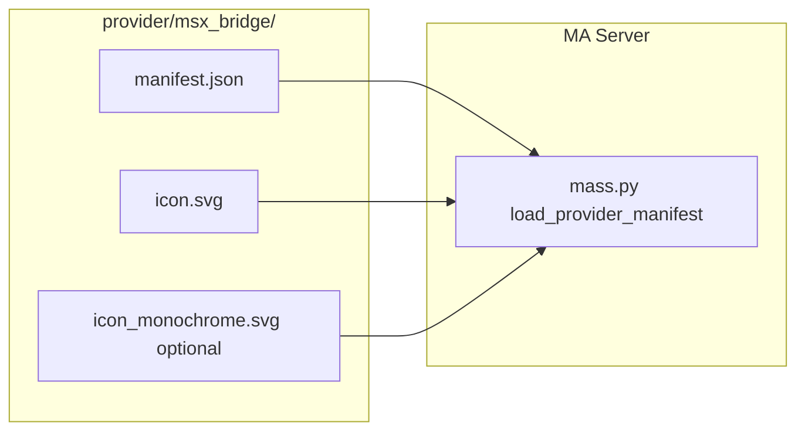

# План: Добавление иконки провайдера MSX Bridge

## Контекст

Music Assistant поддерживает два способа отображения иконок провайдеров:

1. **manifest.json** — поле `"icon"` (например, `"md:tv"`, `mdi:plex`) — ссылка на Material Design / Home Assistant иконку
2. **Локальные SVG** — файлы `icon.svg`, `icon_dark.svg`, `icon_monochrome.svg` в папке провайдера имеют приоритет над manifest.icon

MA загружает SVG из папки провайдера при парсинге манифеста ([mass.py:873-887](https://github.com/trudenboy/ma-server/blob/main/music_assistant/mass.py#L873-L887)). Текущий провайдер использует `"icon": "md:tv"` в [manifest.json](provider/msx_bridge/manifest.json).

## Источник логотипа

- **Сайт:** [Media Station X (TVX)](https://msx.benzac.de/)
- **URL логотипа:** `https://msx.benzac.de/img/icon_raw.png`

## Архитектура решения




MA при загрузке провайдера проверяет наличие `icon.svg` в папке провайдера и, если файл есть, использует его вместо manifest.icon.

## Шаги реализации

### 1. Скачать логотип MSX

Скачать `icon_raw.png` с [https://msx.benzac.de/img/icon_raw.png](https://msx.benzac.de/img/icon_raw.png) в папку проекта (например, `provider/msx_bridge/` или временную директорию).

### 2. Создать icon.svg

Два варианта:

- **Вариант A (рекомендуемый):** Встроить PNG в SVG как base64 (как в [chromecast/icon.svg](https://github.com/music-assistant/server/blob/main/music_assistant/providers/chromecast/icon.svg)) — проще и сохраняет оригинальный вид логотипа
- **Вариант B:** Векторизовать PNG (Inkscape, imagemagick potrace) — даёт масштабируемый SVG, но может изменить детали

Структура icon.svg (по образцу chromecast):

- viewBox `0 0 512 512` или подходящий размер
- `<image>` с `xlink:href="data:image/png;base64,..."` или SVG paths при векторизации

### 3. Создать icon_monochrome.svg (опционально)

Монохромная версия для списков и тёмной темы. Можно:

- Сделать упрощённый силуэт на основе логотипа
- Или скопировать icon.svg и заменить fill на один цвет (если логотип простой)

### 4. Разместить файлы

Положить `icon.svg` (и при необходимости `icon_monochrome.svg`) в `provider/msx_bridge/`:

```
provider/msx_bridge/
├── __init__.py
├── constants.py
├── http_server.py
├── manifest.json
├── player.py
├── provider.py
├── icon.svg              # новый
├── icon_monochrome.svg   # опционально
└── static/
```

### 5. manifest.json

Оставить `"icon": "md:tv"` как fallback — MA всё равно будет использовать icon.svg, если он есть. Альтернатива: удалить поле icon, если SVG всегда будет присутствовать.

## Важные детали

- Провайдер симлинкуется в ma-server через `./scripts/link-to-ma.sh`, поэтому `icon.svg` попадёт в `ma-server/music_assistant/providers/msx_bridge/` вместе с остальными файлами
- Рекомендуемый размер viewBox: 512x512 или 1024x1024 для чёткого отображения
- Проверить лицензию логотипа MSX перед использованием (сайт msx.benzac.de — Benjamin Zachey)

## Проверка

После реализации:

1. Перезапустить MA server
2. Открыть UI — провайдер MSX Bridge должен отображаться с новой иконкой
3. Убедиться, что симлинк корректен: `icon.svg` виден в `ma-server/music_assistant/providers/msx_bridge/`

