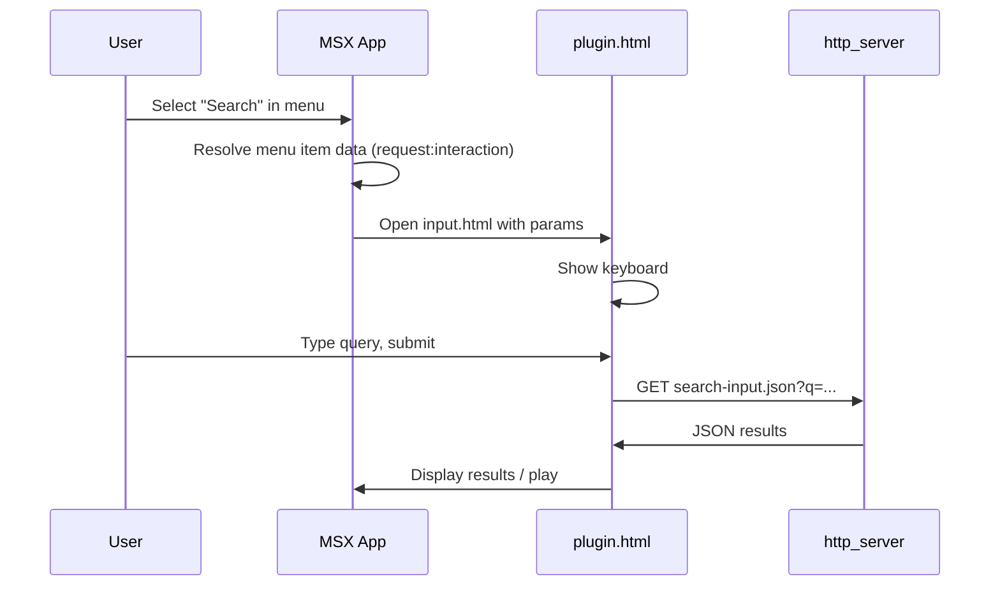

# Похожий на Showcases интерфейс и поиск из меню в один клик

## Анализ MSX Showcases и текущего состояния

**Showcases** ([msx.benzac.de/info](https://msx.benzac.de/info/)) — готовые сервисы (SoundCloud, TMDb, Google Drive, Twitch и др.) с типовым TV-интерфейсом MSX: сайдбар-меню, контентные страницы (list/pages), шаблоны `separate` с иконками и layout. У многих есть поиск (например, SoundCloud: "search content", TMDb: "browse movies").

**Текущий поток поиска у нас:**

1. Пользователь выбирает в меню пункт **Search** → MSX загружает контент по `data: .../msx/search-page.json`.
2. Отображается страница с одной плиткой «Search Music — Press OK to open keyboard».
3. Пользователь нажимает OK → открывается Input Plugin (экранная клавиатура).
4. Ввод запроса → запрос к `.../msx/search-input.json?q=...` → показ результатов.

Итого: **два клика** после выбора пункта меню (сначала плитка, потом уже поиск). В примерах вроде SoundCloud/TMDb поиск логично открывать сразу по выбору пункта.

---

## Можно ли открывать поиск сразу из меню (без лишних кликов)

**Да.** В [Menu Item Object](https://msx.benzac.de/wiki/index.php?title=Menu_Item_Object) поле `data` у пункта меню может быть не только URL контента, но и **request action**:

> "It is also possible to indicate **request actions instead of URLs** (e.g. `request:interaction:{DATA_ID}@{URL}`)."

То есть вместо `data: "http://host/msx/search-page.json"` у пункта **Search** можно передать в `data` строку **request:interaction**, и при выборе этого пункта MSX сразу откроет Interaction Plugin (нашу клавиатуру `input.html`), без загрузки промежуточной контент-страницы.

**Текущая цепочка:** Menu → Content (search-page.json) → User presses OK → Input Plugin.  
**Целевая:** Menu → Input Plugin (один клик по пункту «Search»).

Формат action для Input Plugin мы уже используем в [http_server.py](provider/msx_bridge/http_server.py) (строки 394–398):

```text
content:request:interaction:{search_input_url}|search:3|en|Search Music||||Search...@{input_plugin_url}
```

Для пункта меню в плагине нужно передать в `data` ту же логику в формате, который MSX трактует как request action. В Wiki пример для меню приведён как `request:interaction:{DATA_ID}@{URL}`; полная строка обычно совпадает с тем, что идёт после `content:` в action (URL с плейсхолдером `{INPUT}`, параметры, затем `@URL` плагина). Итоговая строка для пункта Search будет вида:

```text
request:interaction:{BRIDGE}/msx/search-input.json?q={INPUT}&device_id={deviceId}|search:3|en|Search Music||||Search...@{BRIDGE}/msx/input.html
```

(с подставленными `BRIDGE` и при необходимости `device_id`).

---

## План изменений

### 1. Открытие поиска в один клик из меню

**Файл:** [provider/msx_bridge/static/plugin.html](provider/msx_bridge/static/plugin.html)

- В `buildMenu(deviceId)` для пункта **Search** не передавать `data: addDeviceParam(BRIDGE + "/msx/search-page.json", deviceId)`.
- Вместо этого формировать строку **request:interaction**:
  - URL обработчика: `BRIDGE + "/msx/search-input.json?q={INPUT}"` + при наличии `deviceId` добавить `&device_id=...`.
  - Параметры: `|search:3|en|Search Music||||Search...` (как в `_handle_msx_search_page`).
  - URL плагина: `BRIDGE + "/msx/input.html"`.
- Передавать эту строку в `data` пункта Search (например, `data: buildSearchRequestAction(deviceId)` или inline-сборка в `buildMenu`).

В результате выбор «Search» в меню сразу открывает клавиатуру поиска, без промежуточной страницы.

**Совместимость:** Эндпоинт `/msx/search-page.json` можно оставить (например, для прямых ссылок или menu.json), но в основном сценарии (плагин) он больше не будет использоваться для первого шага поиска.

### 2. Визуальный ряд и соответствие Showcases

- **Уже близко:** мы используем типичные для MSX паттерны: `type: "list"`, `template.type: "separate"`, `layout: "0,0,2,4"`, иконки `msx-white-soft:*`, что совпадает с описанием и примерами Quick Start / Wiki.
- **Поиск:** после перехода на request:interaction из меню экран поиска будет тем же Input Plugin (input.html/input.js), с тем же заголовком/подсказкой, что возвращает `search-input.json` при пустом `q` (`headline`, `hint`, `items`). Визуально это уже в духе MSX.
- **Доп. выравнивание (по желанию):** при необходимости можно взять из демо/Wiki точные значения для `headline`/`hint`/placeholder (например, «Search…») и убедиться, что они совпадают с теми, что используются в наших JSON (уже есть «Search», «Type to search…», «Search...»).

Итого: интерфейс уже в той же семантике, что и Showcases; ключевое улучшение UX — **один клик по Search в меню** за счёт использования request:interaction в `data` пункта меню.

### 3. Проверка и риски

- **Формат `data` в меню:** в Wiki явно указано только `request:interaction:{DATA_ID}@{URL}`. Нужно по документации или тестам убедиться, что полная строка с `|search:3|en|...` поддерживается в меню (как в content action). При необходимости — свериться с [Actions](https://msx.benzac.de/wiki/index.php?title=Actions) и примерами плагинов.
- **device_id:** при формировании request:interaction в плагине подставлять `device_id` так же, как сейчас в `addDeviceParam`, чтобы поиск и воспроизведение оставались привязаны к устройству.
- **Тесты:** после изменений проверить вручную на TV/эмуляторе: выбор Search в меню → сразу клавиатура → ввод → результаты и воспроизведение. При наличии автотестов на меню/плагин — добавить или обновить проверку для пункта Search (ожидаемое значение `data` — request:interaction, а не URL search-page.json).

---

## Краткая схема потока (после изменений)




---

## Итог

- **Похожий на Showcases интерфейс:** уже достигается за счёт использования стандартных MSX-структур (list, separate, иконки); при желании можно точечно подравнять тексты.
- **Поиск из меню без лишних кликов:** делается переносом текущего action поиска в `data` пункта меню в формате request:interaction в [plugin.html](provider/msx_bridge/static/plugin.html), с сохранением device_id и оставлением search-page.json для обратной совместимости.

