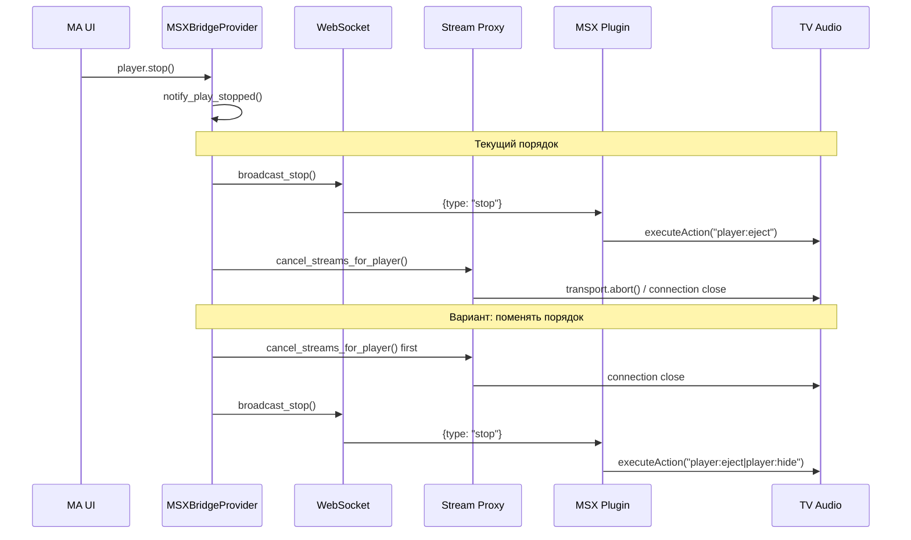

# Варианты решения задержки Stop на MSX

## Контекст

При Stop в MA воспроизведение на TV останавливается с задержкой ~30 сек. В [docs/TODO.md](docs/TODO.md) отмечено: **«Отключение (power off) плеера останавливает сразу»** — это важная подсказка.

Текущий поток: `player.stop()` → `notify_play_stopped()` → `broadcast_stop()` (WebSocket) → `cancel_streams_for_player()`. Плагин получает `{type: "stop"}` и вызывает `executeAction("player:eject")` или `"eject"`.

---

## Вариант 1: Альтернативные MSX actions

### 1.1 Документированные actions (MSX Wiki)

| Action         | Описание                                             |
| -------------- | ---------------------------------------------------- |
| `eject`        | Показывает auto eject panel при активном audio/video |
| `player:eject` | Прямой eject (используется в `cancelPlayback()`)     |

Плагин сейчас: `msg.showNotification ? "eject" : "player:eject"`. Оба варианта уже используются.

### 1.2 Дополнительные Internal Actions (tvx-plugin)

В `tvx-plugin-module.min.js` есть:

- `cancelPlayback()` → `executeAction("player:eject")` — то же самое
- `stopPlayback()` → `setEnded(true, true)` + внутренний колбэк — другой путь
- `hidePlayer()` → `executeAction("player:hide")` — скрывает UI плеера

Идея: попробовать цепочку действий, чтобы быстрее «закрыть» плеер:

- `[player:eject|player:hide]` — Extended Action с несколькими действиями
- Или вызывать `tvx.InteractionPlugin.stopPlayback()` вместо `executeAction("player:eject")`

Файл: [provider/msx_bridge/static/plugin.html](provider/msx_bridge/static/plugin.html), строки 52–55.

---

## Вариант 2: Отмена стрима до broadcast_stop

Сейчас: сначала `broadcast_stop`, потом `cancel_streams_for_player`.

Идея: поменять порядок — сначала `cancel_streams_for_player`, потом `broadcast_stop`.

- Обрыв соединения (transport.abort) может вызвать быстрое завершение воспроизведения на TV
- Риск: WebSocket stop может прийти уже после обрыва; если MSX обрабатывает disconnect до eject, stop будет быстрее

Файлы: [provider/msx_bridge/provider.py](provider/msx_bridge/provider.py) (`notify_play_stopped`), [provider/msx_bridge/http_server.py](provider/msx_bridge/http_server.py).

---

## Вариант 3: Симуляция power off в MA (Stop → power off/on)

Пользовательское наблюдение: power off останавливает сразу. Возможные причины:

1. При power off MA останавливает и скрывает плеер; визуально кажется мгновенным
2. Power off как-то по-другому влияет на поток (например, через Home Assistant / external control)
3. Физическое выключение TV обрывает соединение

Идея: при Stop вызывать `mass.player_queues.cmd_power(player_id, False)`, а затем через короткую задержку — `cmd_power(player_id, True)`.

Важно: `MSXPlayer` не поддерживает `PlayerFeature.POWER`. MA будет использовать fake power (если включён) или не будет power-команды. Нужно проверить, есть ли у MSX player `power_control` и что именно делает MA при power off.

В [ma-server player_controller](https://github.com/music-assistant/hass-music-assistant/blob/master/custom_components/music_assistant/...) при power off вызывается `_handle_cmd_stop` — то есть Stop и Power off проходят одинаковый путь остановки. Тогда разница может быть в UI/восприятии или в другом источнике управления.

Вывод: симуляция power off имеет смысл только если будет подтверждено, что MA обрабатывает power off по-другому.

---

## Вариант 4: Временная unavailable/disable плеера

MA поддерживает `player.available` и `player.state.available`. При `available=False` плеер считается недоступным.

Идея: при Stop временно устанавливать `_attr_available = False`, потом восстанавливать.

- MA может прекратить обновлять состояние и команды
- Риск: команды могут отклоняться, возможны ошибки в UI; не факт, что это ускорит Stop на TV

В `player_controller` команды отклоняются, если `not player.available`. Stop вызывается до проверки — он идёт через queue/player напрямую. Временный `available=False` на самом Stop вряд ли даст нужный эффект.

---

## Рекомендуемый порядок экспериментов

1. **MSX plugin: цепочка actions** — попробовать `[player:eject|player:hide]` вместо одного `player:eject`
2. **MSX plugin: stopPlayback** — вызывать `tvx.InteractionPlugin.stopPlayback()` вместо `executeAction`
3. **Порядок операций** — сначала `cancel_streams_for_player`, затем `broadcast_stop` (опционально с настройкой в config)
4. **Power в MA** — добавить `PlayerFeature.POWER` и `power()` в MSXPlayer и замерить, меняется ли поведение при Stop vs Power off

---

## Диаграмма текущего и альтернативного потока

---

## Файлы для изменений

| Файл                                                                             | Что менять                                     |
| -------------------------------------------------------------------------------- | ---------------------------------------------- |
| [provider/msx_bridge/static/plugin.html](provider/msx_bridge/static/plugin.html) | `executeAction` — пробовать `[player:eject     |
| [provider/msx_bridge/provider.py](provider/msx_bridge/provider.py)               | Порядок вызовов в `notify_play_stopped`        |
| [provider/msx_bridge/player.py](provider/msx_bridge/player.py)                   | Опционально: `PlayerFeature.POWER` и `power()` |

