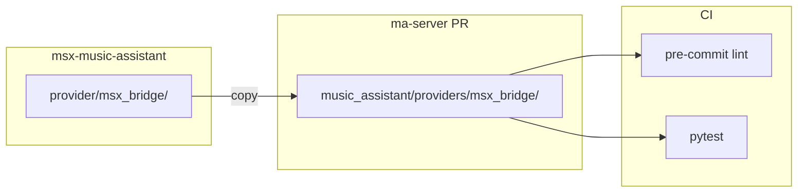

# План PR: добавление MSX Bridge в ma-server

## Цель

Создать Pull Request в [trudenboy/ma-server](https://github.com/trudenboy/ma-server) для включения провайдера MSX Bridge в репозиторий. После мержа провайдер будет встроен в ma-server и не потребует symlink из msx-music-assistant.

## Контекст

- **Источник провайдера:** `msx-music-assistant/provider/msx_bridge/`
- **Целевой репозиторий:** [trudenboy/ma-server](https://github.com/trudenboy/ma-server), ветка `dev`
- **Путь в ma-server:** `music_assistant/providers/msx_bridge/`

## Структура файлов для добавления

```
music_assistant/providers/msx_bridge/
├── __init__.py
├── constants.py
├── http_server.py
├── manifest.json
├── player.py
├── provider.py
├── icon.svg
├── icon_monochrome.svg
└── static/
    ├── input.html
    ├── input.js
    ├── plugin.html
    ├── tvx-plugin-module.min.js
    └── tvx-plugin.min.js
```

## Шаги

### 1. Подготовка ветки

- Клонировать ma-server (или использовать локальный)
- Переключиться на ветку `dev` и подтянуть последние изменения
- Создать новую ветку: `feat/msx-bridge-provider`

### 2. Копирование провайдера

Скопировать содержимое [provider/msx_bridge](msx-music-assistant/provider/msx_bridge/) в `ma-server/music_assistant/providers/msx_bridge/`:

- Все Python-файлы, manifest.json, SVG-иконки
- Папку `static/` целиком

### 3. Обновление manifest.json

Привести manifest к формату ma-server:


| Поле            | Текущее                                     | Рекомендация                                                                              |
| --------------- | ------------------------------------------- | ----------------------------------------------------------------------------------------- |
| `documentation` | `https://github.com/music-assistant/server` | URL документации MSX Bridge (например, README msx-music-assistant или music-assistant.io) |
| `credits`       | —                                           | Добавить: `["[Media Station X](https://msx.benzac.de/)"]`                                 |
| `codeowners`    | `["@renso"]`                                | Оставить или изменить по политике репо                                                    |
| `builtin`       | —                                           | `false` (по умолчанию) — провайдер опциональный                                           |


Пример финального manifest (по аналогии с chromecast):

```json
{
  "type": "player",
  "domain": "msx_bridge",
  "name": "MSX Bridge",
  "description": "Stream music to Smart TVs via Media Station X",
  "codeowners": ["@renso"],
  "credits": ["[Media Station X](https://msx.benzac.de/)"],
  "requirements": [],
  "documentation": "https://github.com/trudenboy/msx-music-assistant",
  "multi_instance": false,
  "stage": "beta",
  "icon": "md:tv",
  "builtin": false
}
```

### 4. requirements_all.txt

У провайдера `requirements: []` — внешних зависимостей нет. Файл [requirements_all.txt](ma-server/requirements_all.txt) генерируется скриптом `scripts/gen_requirements_all.py` по манифестам провайдеров. Регенерировать не нужно — новых зависимостей не добавляется.

### 5. Локальная проверка

```bash
cd ma-server
scripts/setup.sh                    # если venv ещё не настроен
source .venv/bin/activate
python -c "from music_assistant.providers.msx_bridge import setup; print('OK')"
pre-commit run --all-files
pytest tests/ -v
```

### 6. Создание PR

- Закоммитить изменения
- Запушить ветку `feat/msx-bridge-provider` в fork
- Открыть PR: `trudenboy/ma-server` ← `feat/msx-bridge-provider`, base: `dev`

**Описание PR (шаблон):**

```markdown
## feat: Add MSX Bridge Player Provider

Adds MSX Bridge provider for streaming Music Assistant library to Smart TVs via Media Station X (MSX) app.

### Features
- MSX native UI for browsing albums, artists, playlists, tracks
- Audio playback via MA queue with stream proxy
- Library REST API and playback control endpoints

### Changes
- New provider: `music_assistant/providers/msx_bridge/`
- No additional dependencies (uses aiohttp from core)

### References
- [Media Station X](https://msx.benzac.de/)
- [msx-music-assistant](https://github.com/trudenboy/msx-music-assistant)
```

### 7. CI

Workflow [test.yml](ma-server/.github/workflows/test.yml) запускается на PR в ветки `stable` и `dev`:

- Lint: pre-commit (ruff, mypy и др.)
- Test: pytest + coverage

Нужно убедиться, что провайдер успешно импортируется и CI проходит.

## Диаграмма потока




## Важные моменты

- **Тесты:** В ma-server нет провайдер-специфичных тестов в `tests/`. Текущие тесты msx-music-assistant остаются в своём репо. Для PR достаточно, чтобы ma-server успешно импортировал провайдер и CI проходил.
- **Документация:** В manifest поле `documentation` должно указывать на актуальный источник (например, README msx-music-assistant).
- **Ветка:** ma-server использует `dev` как основную ветку разработки (по [trudenboy/ma-server](https://github.com/trudenboy/ma-server)).

