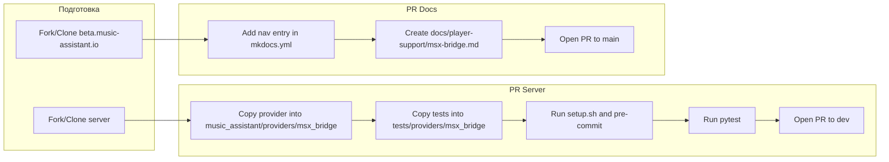

# План: PR провайдера в server и документации в [beta.music-assistant.io](http://beta.music-assistant.io)

## Контекст

- **Провайдер:** MSX Bridge — Player Provider для стриминга музыки MA на Smart TV через приложение [Media Station X](https://msx.benzac.de/). Код и тесты живут в [msx-music-assistant](https://github.com/trudenboy/msx-music-assistant): [provider/msx_bridge/](provider/msx_bridge/) и [tests/](tests/).
- **Upstream server:** [music-assistant/server](https://github.com/music-assistant/server), ветка **dev** (все PR в неё, см. [CLAUDE.md](ma-server/CLAUDE.md)).
- **Документация:** [music-assistant/beta.music-assistant.io](https://github.com/music-assistant/beta.music-assistant.io) — MkDocs, раздел Player Providers в [mkdocs.yml](https://github.com/music-assistant/beta.music-assistant.io/blob/main/mkdocs.yml) (player-support/*.md).

---

## Часть 1: PR в music-assistant/server (ветка dev)

### 1.1 Подготовка репозитория

- Клонировать (или использовать fork) [music-assistant/server](https://github.com/music-assistant/server).
- Создать ветку от **dev**: `git fetch origin dev && git checkout -b feat/msx-bridge-player-provider origin/dev`.

### 1.2 Копирование провайдера

Скопировать содержимое **целиком** из `msx-music-assistant/provider/msx_bridge/` в `music_assistant/providers/msx_bridge/`:


| Источник (msx-music-assistant)                    | Назначение (server)                                 |
| ------------------------------------------------- | --------------------------------------------------- |
| provider/msx_bridge/**init**.py                   | music_assistant/providers/msx_bridge/**init**.py    |
| provider/msx_bridge/constants.py                  | music_assistant/providers/msx_bridge/constants.py   |
| provider/msx_bridge/http_server.py                | music_assistant/providers/msx_bridge/http_server.py |
| provider/msx_bridge/player.py                     | music_assistant/providers/msx_bridge/player.py      |
| provider/msx_bridge/provider.py                   | music_assistant/providers/msx_bridge/provider.py    |
| provider/msx_bridge/manifest.json                 | music_assistant/providers/msx_bridge/manifest.json  |
| provider/msx_bridge/icon.svg, icon_monochrome.svg | music_assistant/providers/msx_bridge/ (то же)       |
| provider/msx_bridge/static/*                      | music_assistant/providers/msx_bridge/static/        |


Импорты в коде уже используют `music_assistant.providers.msx_bridge` — менять не нужно.

**manifest.json:** при желании обновить поле `documentation` на URL страницы документации после мержа PR в beta.music-assistant.io (например `https://beta.music-assistant.io/player-support/msx-bridge/` или стабильный аналог). Пока можно оставить как есть.

### 1.3 Копирование тестов

В server тесты провайдеров лежат в `tests/providers/<domain>/`. Нужно создать каталог и файлы:

- `tests/providers/msx_bridge/__init__.py` — пустой или с докстрингом `"""Tests for MSX Bridge provider."""`.
- `tests/providers/msx_bridge/conftest.py` — скопировать из [tests/conftest.py](tests/conftest.py) (фикстуры `mass_mock`, `player_config_mock`, `http_client` и т.д. специфичны для msx_bridge).
- Перенести модули тестов:
  - [tests/test_init.py](tests/test_init.py) → `tests/providers/msx_bridge/test_init.py`
  - [tests/test_provider.py](tests/test_provider.py) → `tests/providers/msx_bridge/test_provider.py`
  - [tests/test_player.py](tests/test_player.py) → `tests/providers/msx_bridge/test_player.py`
  - [tests/test_http_server.py](tests/test_http_server.py) → `tests/providers/msx_bridge/test_http_server.py`
- Интеграционные тесты (опционально): [tests/integration/](tests/integration/) — скопировать в `tests/providers/msx_bridge/integration/` только если upstream готов их принимать (часто интеграции оставляют вне первого PR или выносят в отдельный тикет).

Во всех перенесённых тестах импорты вида `from music_assistant.providers.msx_bridge ...` уже корректны для структуры server.

### 1.4 Проверки в репозитории server

- Выполнить `scripts/setup.sh` (venv, зависимости, pre-commit).
- Запустить линтеры/форматирование: `pre-commit run --all-files`. Учесть, что mypy может падать на других провайдерах (например zvuk_music); для msx_bridge ошибок быть не должно.
- Запустить тесты провайдера:  
`pytest tests/providers/msx_bridge/ -v`  
При необходимости подправить пути к фикстурам (если что-то осталось в корневом `tests/conftest.py` и нужно дублировать или импортировать).

### 1.5 Оформление PR

- **Base:** `music-assistant/server` → ветка **dev**.
- **Заголовок:** например `feat: Add MSX Bridge Player Provider`.
- **Описание:** использовать/адаптировать [docs/PR_BODY.md](docs/PR_BODY.md) (фичи, новые файлы, тесты, ссылки на MSX и репозиторий).
- Метки: `new feature` (или аналог по правилам репозитория).

---

## Часть 2: PR документации в beta.music-assistant.io

### 2.1 Подготовка репозитория

- Клонировать (или fork) [music-assistant/beta.music-assistant.io](https://github.com/music-assistant/beta.music-assistant.io).
- Создать ветку от **main**: `git checkout -b docs/msx-bridge-player-provider`.

### 2.2 Добавление страницы в навигацию

В корне репозитория в [mkdocs.yml](https://github.com/music-assistant/beta.music-assistant.io/blob/main/mkdocs.yml) в секции **Player Providers** (после существующих пунктов, например после Sendspin) добавить:

```yaml
- MSX Bridge: player-support/msx-bridge.md
```

### 2.3 Создание страницы документации

Создать файл **docs/player-support/msx-bridge.md**. Структуру взять по аналогии с [Sendspin](https://github.com/music-assistant/beta.music-assistant.io/blob/main/docs/player-support/sendspin.md):

- **Заголовок и краткое описание** — Player Provider для стриминга библиотеки MA на Smart TV через приложение Media Station X (MSX).
- **Features** — список возможностей (навигация по библиотеке, воспроизведение, динамическая регистрация плееров, WebSocket, несколько TV и т.д.) из [README](README.md) и [PR_BODY](docs/PR_BODY.md).
- **Configuration** — четыре опции из [manifest.json](provider/msx_bridge/manifest.json) и [constants](provider/msx_bridge/constants.py): HTTP port, output format (MP3/AAC/FLAC), player idle timeout, show stop notification. Кратко описать каждую.
- **Setup on TV** — установка MSX, ввод Start URL: `http://<SERVER_IP>:8099/msx/start.json`, перезапуск MSX. Ссылка на [MSX](https://msx.benzac.de/).
- **How it works** (опционально) — коротко: bootstrap → plugin → меню → контент → audio/stream; WebSocket для push play/stop.
- **Known issues / Limitations** — из [docs/TODO.md](docs/TODO.md) (например отложенная задача по задержке Stop); универсальные ограничения (LAN, одна сеть с MA).
- **Links** — Media Station X, репозиторий msx-music-assistant (или ссылка на раздел в server после мержа).

Иконку провайдера (если нужна в доке) можно не добавлять в первый PR или положить в `docs/assets/` по аналогии с другими провайдерами.

### 2.4 Проверка и PR

- Локально при необходимости: `mkdocs serve`, проверить отображение и навигацию.
- PR в **main** с описанием: добавление документации для MSX Bridge Player Provider.

---

## Порядок выполнения и зависимости




PR в server и PR в docs можно делать **независимо**. Удобно сначала открыть PR в server, затем в docs (и при необходимости обновить `documentation` в manifest после публикации доков).

---

## Краткий чеклист

**Server (dev):**

- Ветка от `dev`
- Скопировать `provider/msx_bridge/` → `music_assistant/providers/msx_bridge/`
- Скопировать тесты в `tests/providers/msx_bridge/` и conftest
- `scripts/setup.sh`, `pre-commit run --all-files`, `pytest tests/providers/msx_bridge/`
- PR с заголовком и телом из PR_BODY.md

**Docs (main):**

- Ветка от `main`
- В mkdocs.yml добавить пункт "MSX Bridge: player-support/msx-bridge.md"
- Создать docs/player-support/msx-bridge.md по структуре sendspin.md
- Открыть PR с описанием добавленной документации

